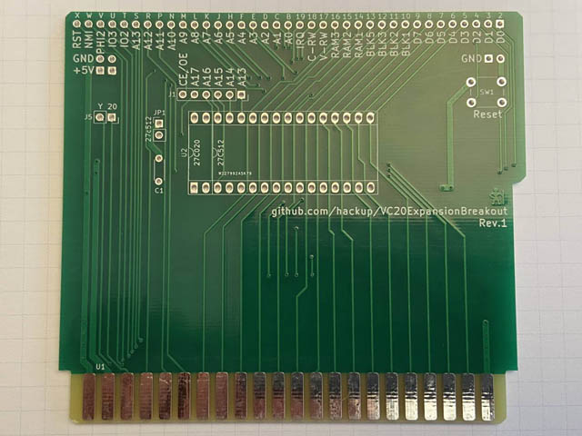

# Commodore VC20/VIC20 Cartridge Port Breakout

This is an adapter board for the [cartridge port](https://en.wikipedia.org/wiki/Commodore_VIC-20#Ports_and_sockets) of the Commodore VIC20 aka. VC20. It connects the cartridge port to a standard 830 pin prototyping breadboard to assist with the development of modules or cartridges.

Additionally, it features an optional on-board slot for either a 27c512 or 27c020 EPROM. The data bus lines D0-D7 and the address bus lines A0-A12 are connected directly to the slot, as are GND and the 5V power rail. The remaining address bus lines of the EPROM and CE/OE are available on J4. Jumper JP1 must be closed if a 27c512 chip is used.

**USE AT YOUR OWN RISK!**

This adapter was modelled after my similar [breakout-board for the C64](https://github.com/hackup/C64ExpansionBreakout).

## License

This work is licensed under a
[Creative Commons Attribution-NonCommercial-ShareAlike 4.0 International License](http://creativecommons.org/licenses/by-nc-sa/4.0/).
